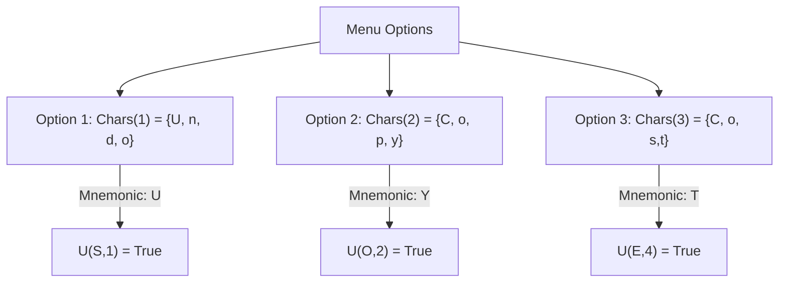

# Keyboard Mnemonics: SAT problem with Z3 (TypeScript)

Assign keyboard mnemonics to a list of options. Given a set of options in a menu, we want to assign
a mnemonic to every option such that there are not two options with the same mnemonic. The solution
has to meet the following constraints:

1. Each option must have a mnemonic.
2. An option cannot have more than one mnemonic.
3. A given character cannot be a mnemonic of two different options.

The problem can be reduced to a SAT. This repository includes the formalization and the implementation. It uses Z3's bindings in TypeScript.

## Formalization

### Problem

## Formalizing the Problem

Each option `i` in the menu has a set of characters associated with it, a set called $Chars(i)$. For
instance, if option `1` is "Undo", $Chars(1)$ might be the set of characters $\{U, n, d, o\}$.

The task is to determine whether a particular character `c` is the mnemonic for a specific `i`.

The menu with $n$ options such that $i \in \{1,...,n\}$. We denote the set of characters $Chars(i)$
that belong to the $i$-th option. Therefore, our problem can be defined as:

$$
\{U_{c,i} | 1 \leq i \leq n, c \in Chars(i)\}
$$

Here, $U_{c,i}$ is true if the character c is the mnemonic of the i -th option.



### Formalization and examples

Let's consider options "undo", "copy", "mod" which can be written as:

```
Uu1, Un1, Ud1, Uo1
Uc2, Uo2, Up2, Uy2
Um3, Uo3, Ud3
```

#### Each option must have a mnemonic.

$$
  \land_{i = 1}^n \lor_{c \in Chars(i)} U_{c,i}
$$

Formalization according to our example:

$$
U_{u,1} \lor U_{n,1} \lor U_{d,1} \lor U_{o,1}
$$

$$
U_{c,2} \lor U_{o,2} \lor U_{p,2} \lor U_{y,2}
$$

$$
U_{m,3} \lor U_{o,3} \lor U\_{d,3}
$$

#### An option cannot have more than one mnemonic.

$$
\land_{i = 1}^n \land_{c \in Chars(i)} (U_{c,i} \implies \land_{t \in \{Chars(i) - c\}} \lnot U\_{t,i})
$$

Formalization according to our example:

$$
U_{u,1} \land U_{n,1} \land U_{d,1} \land U_{o,1} \\
$$

$$
U_{c,2} \land U_{o,2} \land U_{p,2} \land U_{y,2} \\
$$

$$
U_{m,3} \land U_{o,3} \land U\_{d,3} \\
$$

#### A given character cannot be a mnemonic of two different options.

$$
\land_{i = 1}^n \land_{c \in Chars(i)} (U\_{c,i} \implies \land_{1\leq j \leq n \land i \neq j c \in Chars(j)} \lnot U\_{c,j})
$$

Formalization according to our example:

$$
U_{u,1} \implies \lnot U_{n,1} \land \lnot U_{d,1} \land \lnot U_{o,1}
$$

$$
U_{n,1} \implies \lnot U_{u,1} \land \lnot U_{d,1} \land \lnot U_{o,1}
$$

$$
U_{d,1} \implies \lnot U_{u,1} \land \lnot U_{n,1} \land \lnot U_{o,1}
$$

$$
U_{o,1} \implies \lnot U_{u,1} \land \lnot U_{n,1} \land \lnot U_{d,1}
$$

$$
U_{c,2} \implies \lnot U_{o,2} \land \lnot U_{p,2} \land \lnot U_{y,2}
$$

$$
U_{o,2} \implies \lnot U_{c,2} \land \lnot U_{o,2} \land \lnot U_{y,2}
$$

$$
U_{p,2} \implies \lnot U_{c,2} \land \lnot U_{o,2} \land \lnot U_{y,2}
$$

$$
U_{y,2} \implies \lnot U_{c,2} \land \lnot U_{p,2} \land \lnot U_{p,2}
$$

$$
U_{m,3} \implies \lnot U_{o,3} \land \lnot U_{d,3}
$$

$$
U_{o,3} \implies \lnot U_{m,3} \land \lnot U_{d,3}
$$

$$
U_{d,3} \implies \lnot U_{m,3} \land \lnot U_{o,3}
$$

## Installation

OS X & Linux:

Install Node with [asdf](https://github.com/asdf-vm/asdf-nodejs) (version manager):

```
asdf install
```

Install dependencies:

```sh
npm install
```

## Usage example

Define options in index.ts:

```ts
// Menu options
const OPTIONS = ["cut", "copy", "cost"];
```

Run program:

```sh
npm start
```

The program will print the answers:

```
Starting...
Problem was determined to be sat in 252 ms
---- Result: option [mnemonic] ----
cut u
copy y
mod d
```

## Implementation in TypeScript

## Acknowledgment

Assignment from "Static Program Analysis and Constraint Solving" at Universidad Complutense de Madrid. Prof. Manuel Montenegro.
